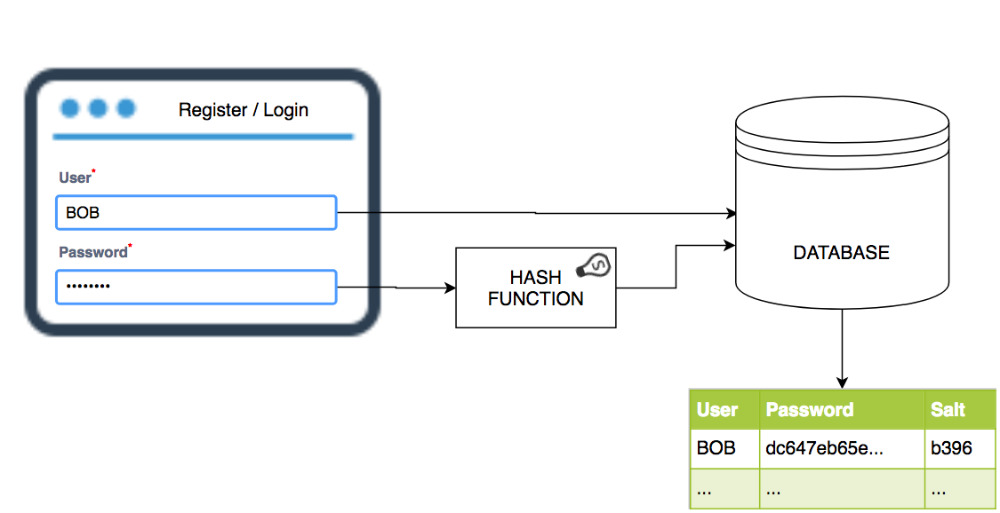
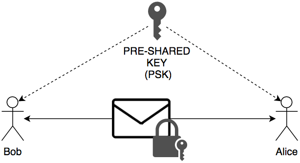
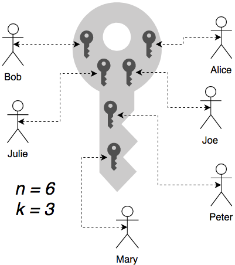
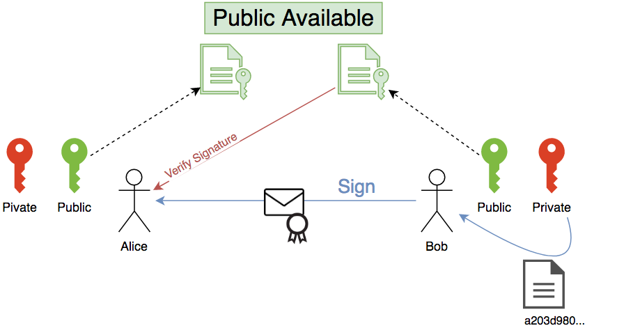

## BECAUSE SECURITY MATTERS!

+++

### DISCLAIMER

Note:

- Não sou expert
- Podem haver erros
- Partilhem conhecimento

---

## FUNÇÕES HASH

+++

### Wikipedia
"_Uma função hash é um algoritmo que mapeia dados de comprimento variável para dados de comprimento fixo_"

+++

### MD5, SHA-1, SHA-256...
```bash
~> echo -n "Security at NOS" | md5sum
bed116fd1d4b8a42925fdf423a11a366

~> echo -n "Security at NOS" | sha1sum
ac3f363ea27197b51319a5120f1a9d60de152ee4

~> echo -n "Security at NOS" | sha256sum
a81210d2cce71a233586b8ec27d9462d8c3a0a540001df450dea67bf26bb6507
```

Uma pequena alteração no input representa uma completa alteração do output:
```bash
~> echo -n "Security at NOs" | md5sum
c259402b446c63ce45e1475f397895ba
```

Note:

- Vários tipos de HASH
- Output de tamanho fixo
- Como funcionam
- Não serve para encriptar, apenas um sentido (there is no way back)

+++

### PARA QUE SERVEM?

+++

#### VALIDAÇÃO DE INTEGRIDADE


Note:

- Downloads
- GIT
- O site também pode ser "hackado" e ter uma hash inválida

+++

#### SEGURANÇA



Note:

- Assinatura Digital
- TLS
- Armazenamento de Passwords (+SALT)

+++


+++

### MD5 IS DEAD...
Usar apenas para validação de integridade, @color[red](NUNCA PARA SEGURANÇA!!!)

+++

### ...AND SHA-1 IS ALSO DEAD


<br>
https://shattered.io/

---

## CRIPTOGRAFIA
### ENCRIPTAÇÃO COM CHAVE SIMÉTRICA, ASSIMÉTRICA E DISTRIBUÍDA

+++

## CHAVE SIMÉTRICA

AES
<br>


+++

## CHAVE DISTRIBUÍDA

Shamir's Secret Sharing
<br>


+++

## CHAVE ASSIMÉTRICA

RSA, Diffie-Hellman

Note:

- Diffie-Hellman: no final do acordo apenas existe uma chave comum

+++

#### RSA

<br>


+++

#### Diffie-Hellman

<br>


Source: [Wikipédia](https://pt.wikipedia.org/wiki/Diffie-Hellman)

+++

## ASSINATURA DIGITAL

<br>


Notes

- Assinar documentos, código, log, etc.
- Assinar com Cartão de Cidadão (PKCS \#11)
- Assinar e encriptar ou encriptar e assinar?

---

## SSL\\TLS
O que são certificados e para que servem
CA (Certificate Authorities) / CSR (Certificate Signing Request) / Let's Encrypt
Google Certificate Transparency (https://www.certificate-transparency.org/)
Man-in-the-middle attack – como funciona
Porque a Google mudou de RSA para ECDHE
Punycode attack (https://www.xudongz.com/blog/2017/idn-phishing/)

---

## SSH + OpenPGP
Como autenticar “sem passwords” (a chave privada deve estar protegida com passphrase)

---

## Yubikey
O que é e para que serve
2FA (two-factor authentication)
  OTP (one-time password)
  OATH authentication (TOTP + HOTP)
  U2F (Universal 2nd Factor)

---

## MouseJack
O que é e como prevenir

---

## RuberDuky + Malduino
O que é
A porta USB é sagrada

---

## JSON Web Tokens - https://jwt.io/ (mais orientado para Dev)
